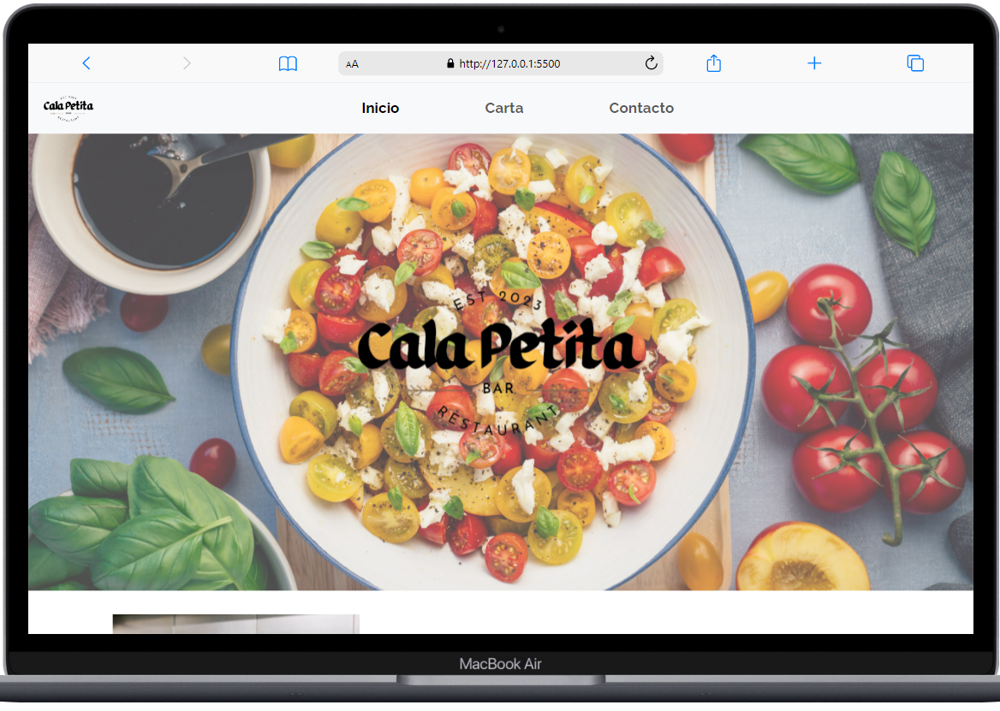
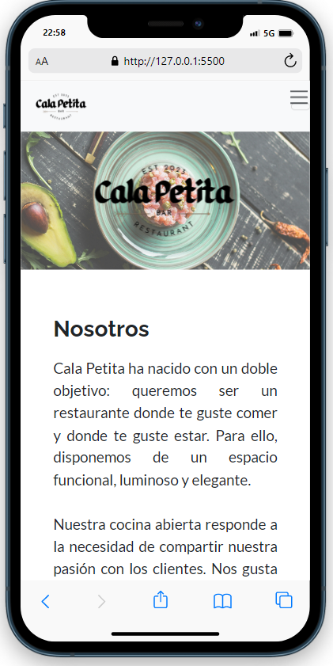

# Welcome to Cala Petita Restaurant

  
Contenido 📝

  <ol>
    <li><a href="#objetivo-🎯">Objetivo</a></li>
    <li><a href="#sobre-el-proyecto-🔎">Sobre el proyecto</a></li>
    <li><a href="#deploy-🚀">Deploy</a></li>
    <li><a href="#stack">Stack</a></li>
    <li><a href="#vistas">Vistas</a></li>
    <li><a href="#contacto">Contacto</a></li>
  </ol>

## Objetivo 🎯

Crear una página web responsive de un restaurante utilizando Bootstrap con tres apartados principales: Inicio, Carta y Contacto.

## Sobre el proyecto 🔎

Es una página web de un restaurant sencilla hecha con Bootstrap incluyendo sus diferentes apartados como el Inicio, Carta y Contacto.

## Deploy 🚀

    🍴<a href="https://kymm14.github.io/restaurante-menu/"><strong>Url a producción</strong></a>🍴

## Stack

 

## Vistas

Desktop💻

Phone📱

## Contacto

